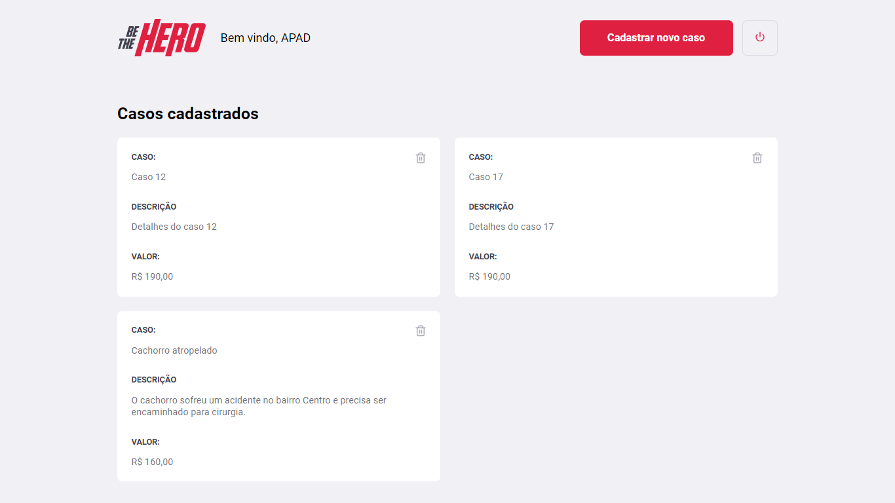
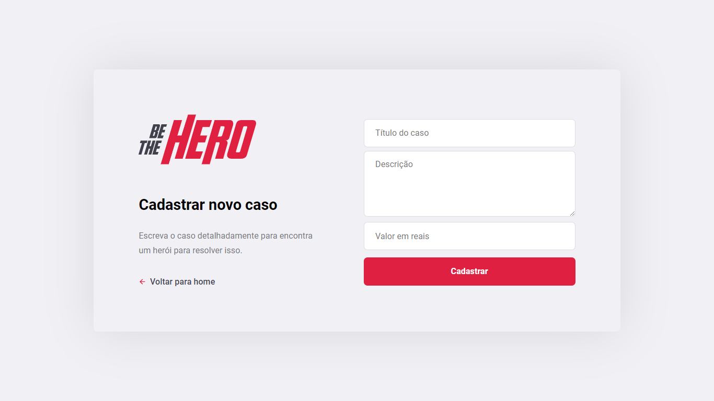

<h1 align="center">
    
    <br />
    Be The Hero - ReactJS
</h1>

<h4 align="center">
  :heart: Escolha um caso e ajude uma ONG
</h4>

<p align="center">
  

  

  

    

  
</p>

<p align="center">
  <a href="#rocket-tecnologias">Tecnologias</a>&nbsp;&nbsp;&nbsp;|&nbsp;&nbsp;&nbsp;
  <a href="#bookmark_tabs-requisitos">Requisitos</a>&nbsp;&nbsp;&nbsp;|&nbsp;&nbsp;&nbsp;
  <a href="#information_source-executar">Executar</a>
</p>







## :rocket: Tecnologias

Este projeto foi desenvolvido no [Bootcamp GoStack - Rocketseat](https://rocketseat.com.br/bootcamp), com as seguintes tecnologias:

-  [ReactJS](https://reactjs.org/)
-  [React Router Dom](https://github.com/ReactTraining/react-router)
-  [Axios](https://github.com/axios/axios)
-  [History](https://www.npmjs.com/package/history)
-  [React-Icons](https://react-icons.netlify.com/)
-  [VS Code][vc] 

## :bookmark_tabs: Requisitos
Antes de executar a aplicação, insira em seu terminal o comando abaixo para iniciar
a api utilizando [json-server](https://github.com/typicode/json-server).

```bash
# Executa a api na porta 3333
$ json-server server.json -p 3333 -w 

```

## :information_source: Executar
Para clonar e executar essa aplicação você precisa do [Git](https://git-scm.com), [Node.js v10.16][nodejs] ou superior + [Yarn v1.13][yarn] ou superior instalado em sua máquina. Em seu terminal de comando, execute:

```bash
# Clone este repositório
$ git clone https://github.com/andersonsts/react-rocketshoes

# Entre no repositorio
$ cd react-rocketshoes

# Instale as dependências
$ yarn install

# Execute a aplicação
$ yarn start
```

---

:rocket: Feito com ♥ por Anderson Santos :wave: [Entre em contato!](https://www.linkedin.com/in/andersonst-dev)


[nodejs]: https://nodejs.org/
[yarn]: https://yarnpkg.com/
[vc]: https://code.visualstudio.com/
[vceditconfig]: https://marketplace.visualstudio.com/items?itemName=EditorConfig.EditorConfig
[vceslint]: https://marketplace.visualstudio.com/items?itemName=dbaeumer.vscode-eslint


